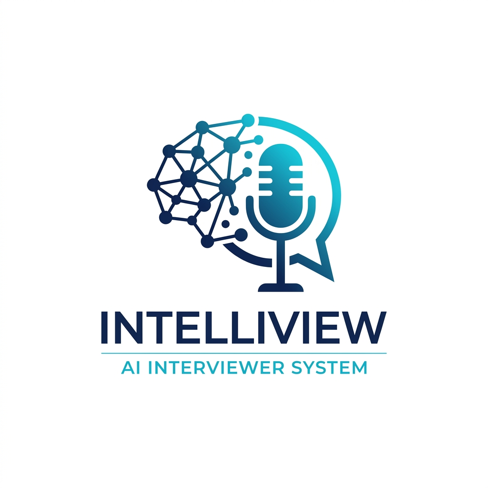
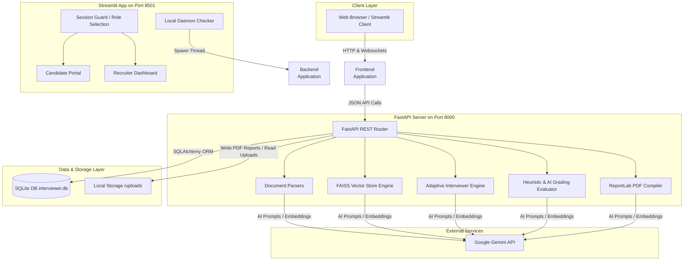
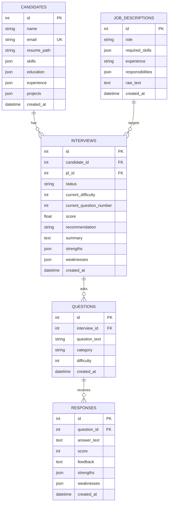
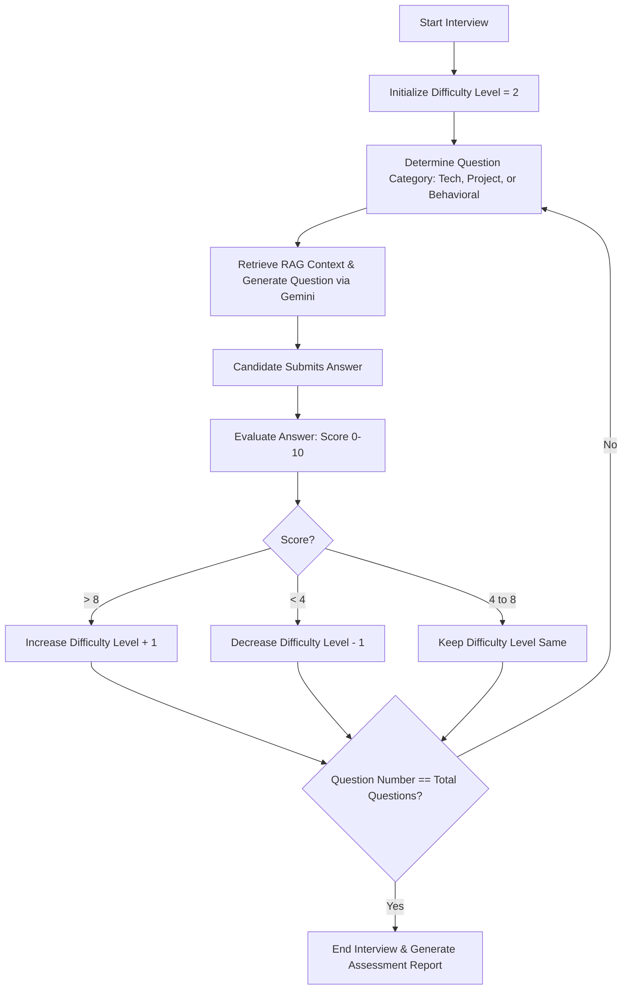
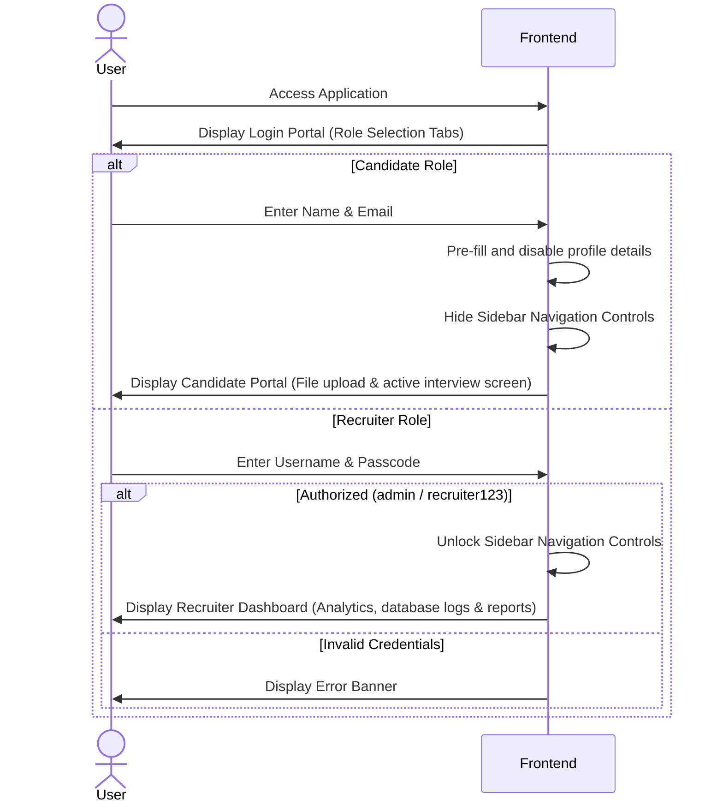

# 🤖 AI-Based Adaptive Interviewer System

An intelligent, context-aware automated recruitment platform designed to conduct interactive, adaptively-scored candidate screening interviews. By parsing PDF resumes and plain text Job Descriptions (JDs), building a local Vector Index (FAISS) for Retrieval-Augmented Generation (RAG), scoring candidate responses in real-time, adjusting question difficulty levels dynamically, and generating professional PDF assessment reports, the system evaluates candidates objectively and scales hiring workflows.

<p align="center">
  
</p>

---

## 🛠️ Architecture & System Design

The system is designed with a decoupled **FastAPI Backend** and a **Streamlit Frontend**, but is engineered with an **Embedded Backend Daemon** to support single-process deployment on platforms like Streamlit Community Cloud.

### High-Level Service Architecture



### Decoupled vs. Daemon Execution Models

1. **Decoupled Local Mode (`run.py`)**:
   - The developer launches the services concurrently using `python run.py`.
   - The script launches **FastAPI** (`uvicorn`) as a background subprocess on `localhost:8000` and **Streamlit** as another subprocess on `localhost:8501`.
   - It monitors both processes and terminates both cleanly if either fails or if a keyboard interrupt (Ctrl+C) is received.

2. **Embedded Daemon Mode (`frontend/app.py`)**:
   - Ideal for serverless or single-container environments like **Streamlit Community Cloud**, which only allows exposing one entry point.
   - On startup, the Streamlit app checks if port `8000` is active.
   - If not active, it spins up the FastAPI backend programmatically inside a `threading.Thread` named `"FastAPI-Backend"`.
   - The frontend then communicates with the backend via standard HTTP loopback queries (`http://127.0.0.1:8000`).

---

## 🗄️ Database Schema & Data Dictionary

The system uses SQLite via the SQLAlchemy ORM. The relational structure is designed to support multi-step ongoing interviews, candidate records, job descriptions, and complete transcripts.



### Table Definitions & Schema

| Table Name | Description | Key Fields & Types | Relationships |
| :--- | :--- | :--- | :--- |
| **`candidates`** | Holds structured metadata of candidates extracted from resumes. | `id` (INT PK), `name` (VARCHAR), `email` (VARCHAR UNIQUE), `resume_path` (VARCHAR), `skills` (JSON List), `education` (JSON List), `experience` (JSON List), `projects` (JSON List), `created_at` (DATETIME). | Has many `interviews`. |
| **`job_descriptions`** | Stores processed details of targeting job openings. | `id` (INT PK), `role` (VARCHAR), `required_skills` (JSON List), `experience` (VARCHAR), `responsibilities` (JSON List), `raw_text` (TEXT), `created_at` (DATETIME). | Has many `interviews`. |
| **`interviews`** | The central state entity coordinating difficulty and overall scores. | `id` (INT PK), `candidate_id` (INT FK), `jd_id` (INT FK), `status` (VARCHAR - 'ongoing'/'completed'), `current_difficulty` (INT - 1 to 4), `current_question_number` (INT), `score` (FLOAT - average), `recommendation` (VARCHAR), `summary` (TEXT), `strengths` (JSON List), `weaknesses` (JSON List), `created_at` (DATETIME). | Belongs to `candidate`, `jd`. Has many `questions`. |
| **`questions`** | Individual questions generated during the interview loop. | `id` (INT PK), `interview_id` (INT FK), `question_text` (TEXT), `category` (VARCHAR - 'technical'/'project'/'behavioral'), `difficulty` (INT - 1 to 4), `created_at` (DATETIME). | Belongs to `interview`. Has one/many `responses`. |
| **`responses`** | Candidate answers, scores, and specific strengths/weaknesses. | `id` (INT PK), `question_id` (INT FK), `answer_text` (TEXT), `score` (INT - 0 to 10), `feedback` (TEXT), `strengths` (JSON List), `weaknesses` (JSON List), `created_at` (DATETIME). | Belongs to `question`. |

---

## 🔍 Deep-Dive: Core Pipeline Implementations

### 1. Document Parsing & Structure Extraction (`parsers.py`)
- **PDF Resume Reader**: PyMuPDF (`fitz`) opens the candidate's PDF and extracts raw text string sequences.
- **Gemini Structured Parsing**: The raw text is passed to the LLM (`models/gemini-3.5-flash`) with instruction prompts specifying a strict JSON return schema. The response is parsed via `json.loads`.
- **Heuristic Failsafe Parser**: If rate limits (HTTP 429) occur, a regex engine automatically extracts contact information (emails) and searches the text for a predefined lexicon of common engineering skills (e.g., Python, SQL, Java, AWS) to construct a structured candidate profile.

### 2. Retrieval-Augmented Generation (RAG) Engine (`vector_store.py`)
To ground LLM questions in the candidate's actual background and target role:
- **Chunking Pipeline**: The raw text is split into paragraphs of maximum 500 characters.
- **Gemini Embeddings**: Chunks are embedded via the `models/gemini-embedding-001` API, generating high-dimensional vectors.
- **FAISS Vector Index**: Chunks are compiled into a FAISS CPU-based index (`faiss.IndexFlatIP`). The vectors are normalized using `faiss.normalize_L2` to ensure inner product searches correspond to Cosine Similarity.
- **Retrieval & Context Generation**: For any generation prompt, the query is embedded, and FAISS retrieves the top $K$ (default: 3) most relevant chunks.
- **Keyword Fallback**: If the embedding API is offline, the search falls back to a substring keyword match score matching word overlaps.

### 3. The Adaptive Interview Loop (`interviewer.py`)
The system dynamically tailors questions in real time:

- **Category Rotation**:
  - **Technical**: Targets core technologies declared in the resume and required by the JD.
  - **Project-based**: References specific projects from the candidate's resume, asking about challenges and architecture decisions.
  - **Behavioral**: Uses the STAR framework to assess teamwork, conflict resolution, and leadership.
  - *Sequence*: Odd questions target Technical topics; Even questions focus on Candidate Projects; the final question is always Behavioral.

- **Difficulty Calibration**:
  - Levels scale from **Level 1 (Fundamentals)** to **Level 4 (Expert/System Design)**.
  - After evaluating each answer, the system adjusts the score out of 10.
  - **Score > 8**: Increases difficulty by 1 level (Max: 4).
  - **Score < 4**: Decreases difficulty by 1 level (Min: 1).
  - **Score 4 - 8**: Difficulty remains unchanged.



- **Failsafe Anti-Repetition**: Standard API calls include history context to prevent duplicate questions. Under API outage conditions, fallback question selectors compare candidate questions against a strict historical hash table to prevent repeating similar questions.

### 4. Robust Response Grading & Evaluator (`evaluator.py`)
- **LLM Assessment**: Evaluates the semantic accuracy of answers against reference RAG context. Returns score, constructive feedback, strengths, and weaknesses in a strict JSON format.
- **Offline Heuristic Grading**: Handles rate-limit errors and network exceptions:
  - If the answer is empty or `< 12` characters, it automatically assigns a score of **1/10**.
  - If the candidate responds with skip-phrases (e.g., *"I don't know"*, *"skip"*), a score of **1/10** is assigned.
  - Length-based baseline scores are awarded for descriptive attempts (Word count $>60 \Rightarrow$ **6/10**, Word count $>25 \Rightarrow$ **5/10**, otherwise **3/10**) to ensure the interview progress continues.

### 5. ReportLab PDF Generation (`reporter.py`)
- **Styles**: Custom stylesheet built on Helvetica, using visual metrics and brand colors (`#1E3A8A` deep blue, `#10B981` emerald, and `#E5E7EB` light gray).
- **Hiring Recommendations**:
  - **Score $\ge$ 8.0**: "Strongly Recommended" (Green badge)
  - **Score $\ge$ 6.0**: "Recommended" (Blue badge)
  - **Score $<$ 6.0**: "Not Recommended" (Red badge)
- **Elements**: Renders candidate/recruiter metadata, dynamic performance indicators, executive summaries generated via LLM review, strengths/weaknesses comparison blocks, and full interactive transcripts.

---

## 🔒 Role-Based Access Control & User Flows

The system maintains a simple but secure dual-access frontend flow to segregate candidate testing and recruiter admin functions.



---

## 💻 Installation & Local Quickstart

### Prerequisites
- Python 3.10 or 3.11 installed.
- A Google Gemini API key.

### 1. Setup Environment
```bash
# Clone the repository
git clone https://github.com/your-username/AI_Interviewer.git
cd AI_Interviewer

# Create and activate virtual environment
python -m venv venv
venv\Scripts\activate  # On macOS/Linux: source venv/bin/activate

# Install unified requirements
pip install -r requirements.txt
```

### 2. Configure Environmental Secrets
Create a `.env` file in the root directory:
```env
GEMINI_API_KEY=your_google_gemini_api_key_here
GEMINI_MODEL=models/gemini-3.5-flash
```

### 3. Launch Services
Run the system booster:
```bash
python run.py
```
- **Streamlit App**: http://127.0.0.1:8501
- **FastAPI Documentation (Swagger)**: http://127.0.0.1:8000/docs

---

## 🚀 Streamlit Cloud Deployment Setup

To host the application as a single-process service on Streamlit Community Cloud:

1. **GitHub Setup**: Push all files to your GitHub repository. Ensure `.env` is ignored by `.gitignore`.
2. **Launch Streamlit Console**:
   - Go to your Streamlit Cloud Workspace and click **New app**.
   - Select your repository, branch, and set the **Main file path** to:
     ```text
     frontend/app.py
     ```
3. **Configure Secrets**:
   - In the app settings on Streamlit Cloud, go to the **Secrets** section.
   - Enter your API credentials using the TOML format:
     ```toml
     GEMINI_API_KEY = "AIzaSy..."
     ```
4. **Deploy**: Streamlit Cloud will run `frontend/app.py`. The built-in daemon checker will detect that port `8000` is vacant and automatically spawn the FastAPI service in the background. The app will install all unified dependencies and run successfully.
